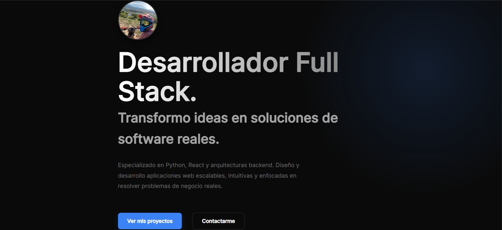

# 💻 Rodrigo Antúnez | Portfolio Web

🔗 **Visitar sitio en vivo:** [rodria45.github.io/rodrigo-antunez-portfolio](https://rodria45.github.io/rodrigo-antunez-portfolio/)




> Portafolio interactivo personal desarrollado para exhibir mi experiencia, habilidades y proyectos destacados como Desarrollador Full Stack.

---

## ✨ Características Principales

- **Diseño Moderno:** Estética oscura profesional (*Dark Mode*) con toques sutiles de *glassmorphism* y micro-interacciones.
- **Arquitectura Escalable:** Construido con componentes funcionales de React para máxima reutilización y código limpio.
- **Tipado Fuerte:** Desarrollado íntegramente en TypeScript para garantizar estabilidad y prever errores en tiempo de desarrollo.
- **Privacidad Estratégica:** Los proyectos se cargan desde un archivo local, lo que permite mantener repositorios de código privados o corporativos en GitHub, sin perder la capacidad de exhibir demos y descripciones en la web.
- **Mobile First:** Adaptabilidad perfecta en dispositivos móviles, tablets y escritorio.

## 🛠️ Tecnologías Core

- **Frontend Framework:** React 18
- **Build Tool:** Vite
- **Lenguaje:** TypeScript
- **Estilos:** CSS3 Vanilla (Implementación de UI con Variables CSS globales)
- **Iconografía:** React Icons
- **Despliegue e Integración Continua (CI/CD):** GitHub Actions / GitHub Pages

## 🚀 Despliegue Local (Getting Started)

Instrucciones para levantar el entorno de desarrollo local:

### 1. Clonar el repositorio
```bash
git clone https://github.com/RodriA45/rodrigo-antunez-portfolio.git
cd rodrigo-antunez-portfolio
```

### 2. Modo Automático (Solo Windows)
El proyecto incluye un script de inicialización. Haz doble clic en el archivo `start.bat`. Este ejecutable validará, instalará las dependencias necesarias de npm de manera automatizada e inicializará el servidor.

### 3. Modo Manual (Cualquier SO)
Instala las dependencias:
```bash
npm install
```

Inicia el servidor en modo desarrollo:
```bash
npm run dev
```
La aplicación estará disponible en `http://localhost:5173/`.

## 📁 Gestión y Mantenimiento de Datos

Toda la información exhibida en el portafolio (Descripciones, Stacks tecnológicos, Links a repositorios, Demos e Imágenes) se encuentra centralizada, evitando depender de APIs de terceros y asegurando tiempos de carga inmediatos.

Ruta del esquema de datos: `src/data/projects.ts`

Para integrar nuevos trabajos, basta con anexar un objeto tipado que cumpla con la interfaz `Project` exportada en dicho módulo.

---
**© 2026 Rodrigo Antúnez.**
Transformando ideas complejas en experiencias digitales de alta calidad.